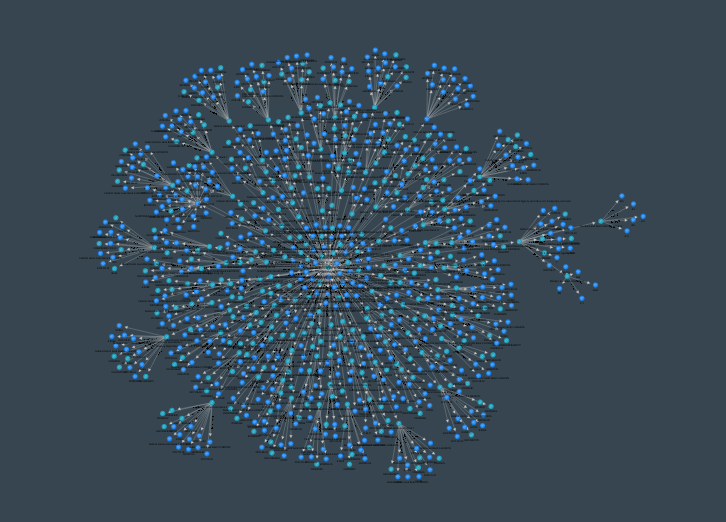

# Nexus Client

  

## Description
This is the repository for the Nexus Client Online Investigation software. Nexus allows you to perform online investigations by representing information as discrete pieces of data, called Entities. These Entities can then be explored through Resolutions, which take the attributes of Entities as input, and resolve them to different, but connected, pieces of information. In such a way, one can create a knowledge graph (or abstract art) for any particular domain, which should help investigators easily discover answers and insights that otherwise might have been hard to extract.

## Features
Some notable features of Nexus include:

### Client
- Graph visualisation of information and their relationships
- Drag and drop interface to add new data
- Timeline of events based on creation date of entities
- Import browser tabs and take screenshots of your session
- Display locations on a world map
- Easily extensible to suit your specific needs

### Server
- Collaborate with others live on projects
- Extract sentiment, entities and relationships from files
- Extract text from over 100 types of documents, and get summaries of the content for large files
- Ask the Oracle a question about the data, and receive an answer with context

## Installation
### Supported Platforms
Currently, Linux (Ubuntu, but most Debian derivatives should work) and Windows 10 are supported.

The versions differ slightly because a graph-related library is not available for Windows. This means that the Windows and the Linux build and code differ slightly from each other - where Linux uses SFDP graph layout, Windows uses Neato. Practically, the difference should not be noticable. Windows has a few more visual bugs than Linux, but both versions should function the same.

This repository has the code for the Linux version, with the Windows alternative code commented out where applicable.

### Installing Dependencies
Some dependencies need to be installed in order for the software to work properly. After downloading the release correspoding to your platform from the Releases tab, please perform the following steps to install the required dependencies:
1. Linux
	- `sudo apt update && sudo apt install libopengl0 graphviz libmagic1 -y`
	- Download geckodriver and add it to your PATH: https://github.com/mozilla/geckodriver/releases
	- Download chromedriver and add it to your PATH: https://chromedriver.chromium.org/
2. Windows
	- Download and install the graphviz package from https://www.graphviz.org/download/
	- Download geckodriver and add it to your PATH: https://github.com/mozilla/geckodriver/releases
	- Download chromedriver and add it to your PATH: https://chromedriver.chromium.org/

Helpful link for those unfamiliar with adding binaries to their PATH: https://zwbetz.com/how-to-add-a-binary-to-your-path-on-macos-linux-windows/
Releases (most recent one on the top): https://github.com/AccentuSoft/Nexus_Client/releases

The software comes packaged in a 7zip archive. Uncompress the archive, and double-click the executable to start the software. On Windows, the executable should be named 'Nexus.exe'. On Linux, it should be named 'Nexus'.

### Running from source
One could also clone the repository and run the software as-is.

On Linux, the dependencies and requirements (in requirements.txt) need to be installed, and then one can run the software by executing Nexus.py.

On Windows, the dependencies and requirements need to be installed, as well as the python-magic-bin library. This is done as follows:

`pip install python-magic-bin`

Then, the Linux-specific functions need to be changed to the Windows version. Currently, this is just the 'rearrangeGraph' function in Core/Interface/CentralPane. The comments at that location indicate the required changes.

## Extending the software
Nexus was built from the ground up to be modular! In this repository's wiki, there are instructions on how to create your own modules, which can contain custom Entities and Resolutions. There is also an example module in the Modules directory that can act as a template, and has a verbose description of most things that a module creator should need to consider.

## Security and safety
Some warnings about using the software:

### Do NOT open any kind of project file given to you by untrusted sources.
Maliciously crafted files can be used to potentially execute arbitrary code on your computer. The safe way of importing work from others is by having the source export their database as a GraphML file, which another user can then import.

### Do NOT use Resolutions obtained by untrusted sources.
Resolutions are essentially Python code that ingests information from various data sources. Make sure that the people providing you with code to run are trustworthy, and that you inspect all the modules you use before installing them. Pre-compiled binaries on systems without Python installed are not able to install new resolutions, so compiling custom versions of the client to suit your investigators' needs should effectively mitigate this risk.

## Further reading
If you are interested in more information about using the software, tutorials and case studies, check out our blog at https://accentusoft.com/blog/.

If you would like to contribute a post about your use of the software, please send an email to socials@accentusoft.com.

  

