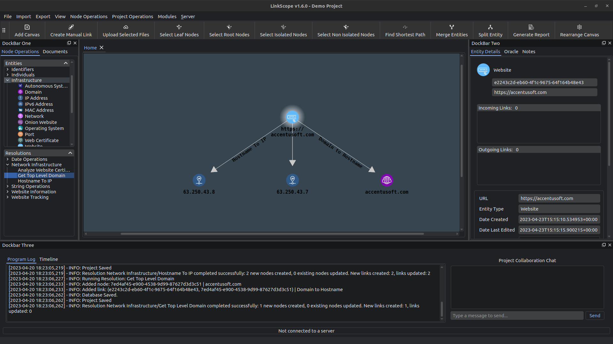

# LinkScope Client

  

## Installer Download
Get the installer for LinkScope Client from here:

https://accentusoft.com/downloads/

## Description
This is the repository for the LinkScope Client Online Investigation software. LinkScope allows you to perform online investigations by representing information as discrete pieces of data, called Entities.

These Entities can then be explored through Resolutions, which take the attributes of Entities as input, and resolve them to different, but connected, pieces of information.

In that way, one can create a knowledge graph (or abstract art) for any particular domain, which should help investigators easily discover answers and insights that otherwise might have been hard to extract.

## Features
Some notable features of LinkScope include:

### Client
- Graph visualisation of information and their relationships
- Drag and drop interface to add new data
- Timeline of events based on creation date of entities
- Import browser tabs and take screenshots of your session
- Display locations on a world map
- Easily extensible to suit your specific needs

### Server
- Collaborate with others live on projects
- Extract sentiment, entities and relationships from files
- Extract text from over 100 types of documents, and get summaries of the content for large files
- Ask the Oracle a question about the data, and receive an answer with context

## Installation
### Supported Platforms
Currently, Linux (Ubuntu 22.04, but most Debian derivatives should work) and Windows 11 are supported.

Note that the SFDP graph layout does not function on Windows, as an essential graph related library is not available on that platform.

### Installing the software
Since Version 1.0.0, installers are provided for Windows 11 and Linux (Ubuntu) platforms.

Download the latest installer for your platform from the Releases page, and run it to install the software:
https://github.com/AccentuSoft/LinkScope_Client/releases/tag/v1.6.2

Note: On Ubuntu, you may need to mark the downloaded installer as executable before you can run it. To do this, right-click the installer, and from the drop-down menu, select 'properties'. On the dialog window that pops up, navigate to the 'Permissions' tab, and make sure that 'Allow executing file as program' is checked. You should at this point be able to run the installer by double-clicking it. If double-clicking the installer does not start it, you can also launch the installer through a terminal.

### Running from source
One could also clone the repository and run the software as-is.

Some dependencies need to be installed in order for the software to work properly. After downloading the release correspoding to your platform from the Releases tab, please perform the following steps to install the required dependencies:
1. Linux
    - `sudo apt update && sudo apt install libopengl0 graphviz libmagic1 -y`
    - `pip install -r requirements.txt --upgrade`
    - `playwright install`
2. Windows
   - Download and install the graphviz package from https://www.graphviz.org/download/
   - `pip install -r requirements.txt --upgrade`
   - Build the magic binaries from https://github.com/nscaife/file-windows and put them
   next to the `loader.py` script in the `magic` module folder of your python installation
   or virtual environment.
   - `python PatchMagicWin.py`
   - `playwright install`
   
The software comes packaged in a 7zip archive. Uncompress the archive, and double-click the executable to start the software. On Windows, the executable should be named 'LinkScope.exe'. On Linux, it should be named 'LinkScope'.

## Instructions & Resources
The Wiki page contains a manual on using the tool, available here: https://github.com/AccentuSoft/LinkScope_Client/wiki

We have an introductory blog post that explains the basics of using the tool, available here: https://accentusoft.com/tutorials/first-steps-with-linkscope-client/

We also have some videos demonstrating how to use the software on our YouTube channel: https://www.youtube.com/channel/UC8h9Vde1OdezdC2cJ1nEUcw

## Extending the software
LinkScope was built from the ground up to be modular! In this repository's wiki, there are instructions on how to create your own modules, which can contain custom Entities and Resolutions. There is also an example module in the Modules directory that can act as a template, and has a verbose description of most things that a module creator should need to consider.

## Security and safety
Warnings and best practices on using the software:

### Do NOT use Resolutions obtained by untrusted sources.
Resolutions are essentially Python code that ingests information from various data sources. Make sure that the people providing you with code to run are trustworthy, and that you inspect all the modules you use before installing them.

### Do NOT interact with unsafe resources without sufficient protection measures.
Some resources that an investigator may access through the software may pose a risk to the investigator and/or the assets used during the investigation. Some examples include, but are not limited to: Sites that host malicious code, torrents for malware, or forums that contain illegal materials. Handling the risk of investigating targets and materials that may be harmful to the investigator and/or the equipment used during the investigation is completely up to the investigator.

We recommend utilizing virtual machines (VMs) during investigations that may call for interaction with unsafe resources in order to minimize the impact of mishandling dangerous resources.

## Further reading
If you are interested in more information about using the software, tutorials and case studies, check out our blog at https://accentusoft.com/blog/.

If you would like to contribute a post about your use of the software, please send an email to socials@accentusoft.com.

  

